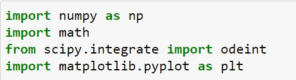
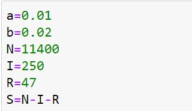
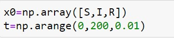
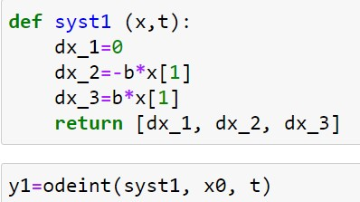
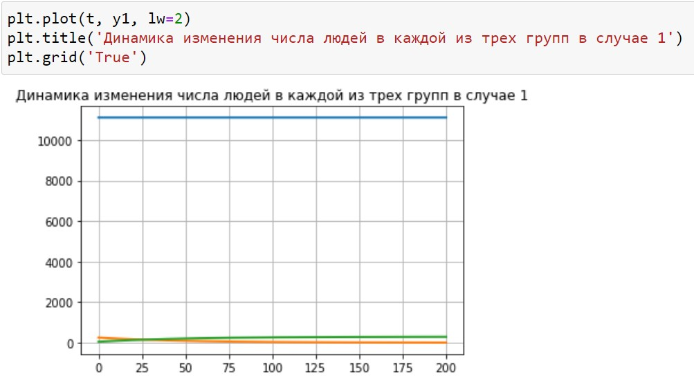
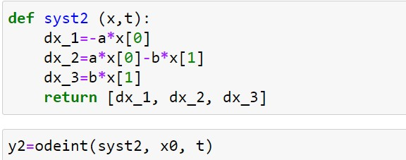
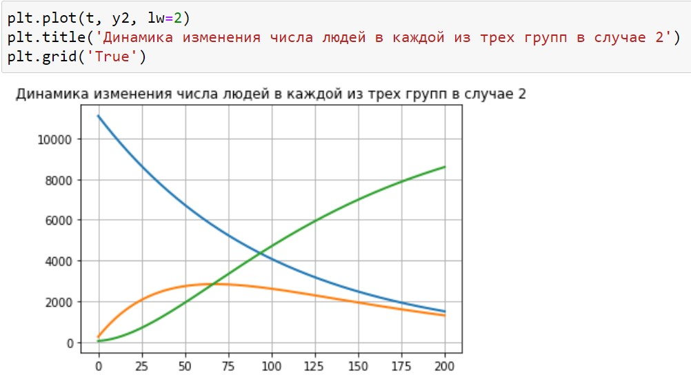

---
## Front matter
title: "Лабораторная работа №6: Задача об эпидемии"
subtitle: "*дисциплина: Математическое моделирование*"
author: "Голова Варвара Алексеевна"
date: 2021, 18 March

## Formatting
mainfont: PT Serif
romanfont: PT Serif
sansfont: PT Sans
monofont: PT Mono
toc: false
slide_level: 2
theme: metropolis
header-includes:
 - \metroset{progressbar=frametitle,sectionpage=progressbar,numbering=fraction}
 - '\makeatletter'
 - '\beamer@ignorenonframefalse'
 - '\makeatother'
aspectratio: 43
section-titles: true

---

# Цель работы

Ознакомиться с задачей об эпидемии, рассмотреть ее модель и построить графики по этой модели.

# Задание

На одном острове вспыхнула эпидемия. Известно, что из всех проживающих на острове ($N=11 400$) в момент начала эпидемии ($t=0$) число заболевших людей (являющихся распространителями инфекции) $I(0)=250$, а число здоровых людей с иммунитетом к болезни $R(0)=47$. Таким образом, число людей восприимчивых к
болезни, но пока здоровых, в начальный момент времени $S(0)=N-I(0)- R(0)$.
Построить графики изменения числа особей в каждой из трех групп.
Рассмотреть, как будет протекать эпидемия в случае:
1) если $I(0)\leq I^*$
2) если $I(0)> I^*$

# Выполнение лабораторной работы

## Библиотеки

Подключаю все необходимые библиотеки(рис. -@fig:001).

{ #fig:001 width=70% }

## Значения

Ввод значений из своего варианта (28 вариант)(рис. -@fig:002).

{ #fig:002 width=70% }

## Значения

Ввод значений (рис. -@fig:003).

{ #fig:003 width=70% }

## Решение для случая №1

Решение системы для случая $I(0)\leq I^*$ (рис. -@fig:004).

{ #fig:004 width=70% }

## Вывод графика для случая $I(0)\leq I^*$

Вывод динамики изменения числа людей в каждой из трех групп(рис. -@fig:005).

{ #fig:005 width=70% }

## Решение для случая №2

Решение системы для случая $I(0)> I^*$ (рис. -@fig:006).

{ #fig:006 width=70% }

## Вывод графика для случая $I(0)> I^*$

Вывод динамики изменения числа людей в каждой из трех групп(рис. -@fig:007).

{ #fig:007 width=70% }

# Выводы

Я ознакомилась с задачей об эпидемии, рассмотрела ее модель и построила графики по этой модели.
