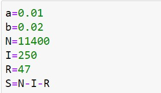
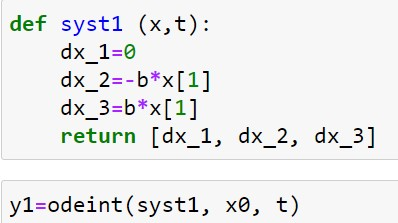

---
# Front matter
title: "Отчет по лабораторной работе №6"
subtitle: "Задача об эпидемии"
author: "Голова Варвара Алексеевна"
group: "НФИбд-03-18"
ID: "1032182507"

# Formatting
toc-title: "Содержание"
toc: true # Table of contents
toc_depth: 2
lof: true # List of figures
fontsize: 12pt
linestretch: 1.5
papersize: a4paper
documentclass: scrreprt
polyglossia-lang: russian
polyglossia-otherlangs: english
mainfont: PT Serif
romanfont: PT Serif
sansfont: PT Sans
monofont: PT Mono
mainfontoptions: Ligatures=TeX
romanfontoptions: Ligatures=TeX
sansfontoptions: Ligatures=TeX,Scale=MatchLowercase
monofontoptions: Scale=MatchLowercase
indent: true
pdf-engine: lualatex
header-includes:
  - \linepenalty=10 # the penalty added to the badness of each line within a paragraph (no associated penalty node) Increasing the value makes tex try to have fewer lines in the paragraph.
  - \interlinepenalty=0 # value of the penalty (node) added after each line of a paragraph.
  - \hyphenpenalty=50 # the penalty for line breaking at an automatically inserted hyphen
  - \exhyphenpenalty=50 # the penalty for line breaking at an explicit hyphen
  - \binoppenalty=700 # the penalty for breaking a line at a binary operator
  - \relpenalty=500 # the penalty for breaking a line at a relation
  - \clubpenalty=150 # extra penalty for breaking after first line of a paragraph
  - \widowpenalty=150 # extra penalty for breaking before last line of a paragraph
  - \displaywidowpenalty=50 # extra penalty for breaking before last line before a display math
  - \brokenpenalty=100 # extra penalty for page breaking after a hyphenated line
  - \predisplaypenalty=10000 # penalty for breaking before a display
  - \postdisplaypenalty=0 # penalty for breaking after a display
  - \floatingpenalty = 20000 # penalty for splitting an insertion (can only be split footnote in standard LaTeX)
  - \raggedbottom # or \flushbottom
  - \usepackage{float} # keep figures where there are in the text
  - \floatplacement{figure}{H} # keep figures where there are in the text
---

# Цель работы

Ознакомиться с задачей об эпидемии, рассмотреть ее модель и построить графики по этой модели.

# Задание

Вариант 28

На одном острове вспыхнула эпидемия. Известно, что из всех проживающих на острове ($N=11 400$) в момент начала эпидемии ($t=0$) число заболевших людей (являющихся распространителями инфекции) $I(0)=250$, а число здоровых людей с иммунитетом к болезни $R(0)=47$. Таким образом, число людей восприимчивых к
болезни, но пока здоровых, в начальный момент времени $S(0)=N-I(0)- R(0)$.
Построить графики изменения числа особей в каждой из трех групп.
Рассмотреть, как будет протекать эпидемия в случае:
1) если $I(0)\leq I^*$
2) если $I(0)> I^*$

#Теоретическая справка

Рассмотрим простейшую модель эпидемии. Предположим, что некая популяция, состоящая из N особей, (считаем, что популяция изолирована) подразделяется на три группы. Первая группа - это восприимчивые к болезни, но пока здоровые особи, обозначим их через $S(t)$. Вторая группа – это число инфицированных особей, которые также при этом являются распространителями
инфекции, обозначим их $I(t)$. А третья группа, обозначающаяся через $R(t)$ – это здоровые особи с иммунитетом к болезни.

До того, как число заболевших не превышает критического значения $I^*$, считаем, что все больные изолированы и не заражают здоровых. Когда $I(t)>I^ *$, тогда инфицирование способны заражать восприимчивых к болезни особей.

Таким образом, скорость изменения числа S(t) меняется по следующему
закону:
$$\frac{dS}{dt}=
\begin{cases}
-\alpha S, & \text {если } I(t)>I^*\\
0, &\text {если } I(t)\leq I^*
\end{cases}
$$

Поскольку каждая восприимчивая к болезни особь, которая, в конце концов, заболевает, сама становится инфекционной, то скорость изменения числа
инфекционных особей представляет разность за единицу времени между заразившимися и теми, кто уже болеет и лечится, т.е.:

$$\frac{dI}{dt}=
\begin{cases}
-\alpha S - \beta I , & \text {если } I(t)>I^*\\
-\beta I, &\text {если } I(t)\leq I^*
\end{cases}
$$

А скорость изменения выздоравливающих особей (при этом приобретающие иммунитет к болезни)
$$\frac{dR}{dt}=\beta I$$
Постоянные пропорциональности $\alpha, \beta$ - это коэффициенты заболеваемости
и выздоровления соответственно.

Для того, чтобы решения соответствующих уравнений определялось однозначно, необходимо задать начальные условия. Считаем, что на начало
эпидемии в момент времени $t=0$ нет особей с иммунитетом к болезни $R(0)=0$, а число инфицированных и восприимчивых к болезни особей
$I(0)$ и $S(0)$ соответственно.

# Выполнение лабораторной работы

## Библиотеки

Подключаю все необходимые библиотеки(рис. -@fig:001).

{ #fig:001 width=70% }

## Значения

Ввод значений из своего варианта (28 вариант)(рис. -@fig:002).

{ #fig:002 width=70% }

## Значения

Ввод значений (рис. -@fig:003).

{ #fig:003 width=70% }

## Решение для случая №1

Решение системы для случая $I(0)\leq I^*$ (рис. -@fig:004).

{ #fig:004 width=70% }

## Вывод графика для случая $I(0)\leq I^*$

Вывод динамики изменения числа людей в каждой из трех групп(рис. -@fig:005).

{ #fig:005 width=70% }

## Решение для случая №2

Решение системы для случая $I(0)> I^*$ (рис. -@fig:006).

{ #fig:006 width=70% }

## Вывод графика для случая $I(0)> I^*$

Вывод динамики изменения числа людей в каждой из трех групп(рис. -@fig:007).

{ #fig:007 width=70% }

# Выводы

Я ознакомилась с задачей об эпидемии, рассмотрела ее модель и построила графики по этой модели.
